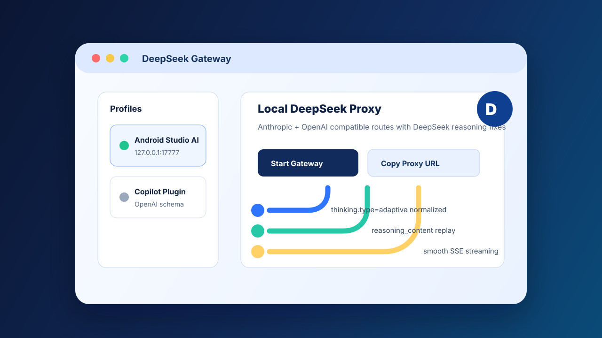
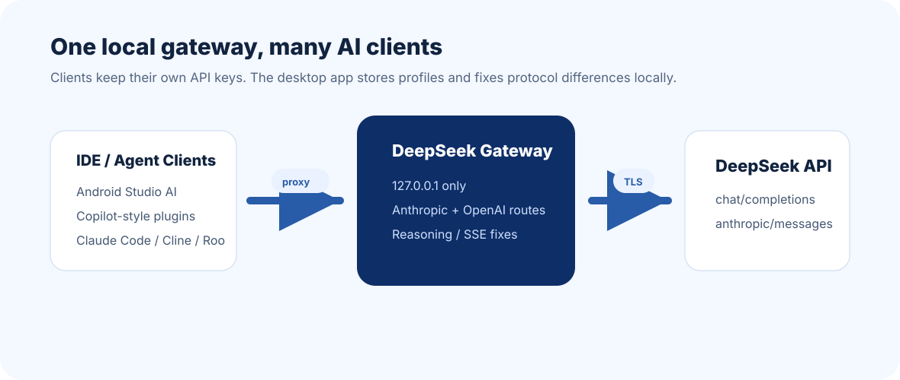
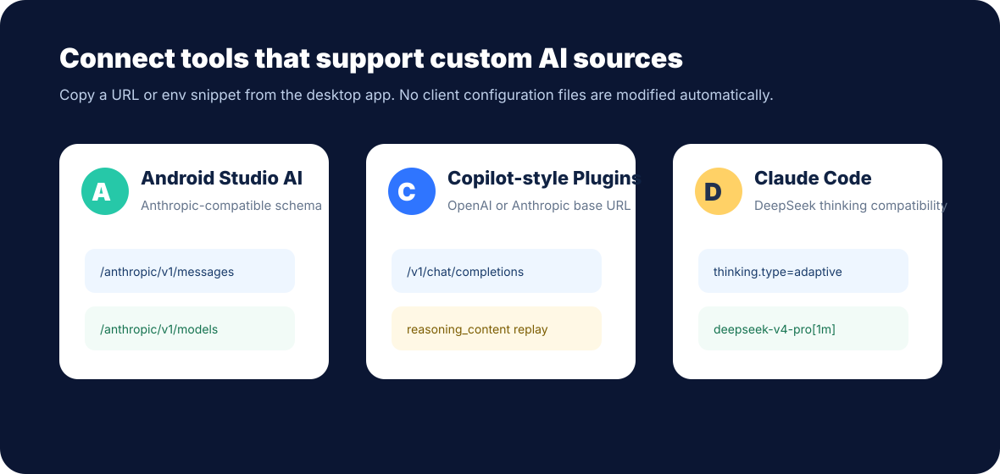

# DeepSeek Gateway



**DeepSeek Gateway** is a macOS and Windows desktop app that runs local DeepSeek proxy profiles for IDE AI tools, agent clients, and plugins that support custom OpenAI-compatible or Anthropic-compatible endpoints.

It is designed for DeepSeek + Claude Code style compatibility problems: `reasoning_content` replay, SSE thinking streams, unsupported `thinking.type=adaptive`, effort mapping, and model defaults such as `deepseek-v4-pro[1m]`.

> This project is not an official DeepSeek application. API keys are supplied by your client and are never stored by the desktop app.

## 多语言简介

**中文**  
DeepSeek Gateway 是一个本地桌面网关。你可以在应用里添加多个代理配置，点击启动后得到 `http://127.0.0.1:<port>` 本地地址，然后把 Android Studio AI、Copilot 类插件、Claude Code、Cline、Roo、Kilo 等支持自定义三方 AI 源的工具指向这个地址。它会把 Anthropic/OpenAI 兼容请求转发到 DeepSeek，并处理 DeepSeek thinking/reasoning 的兼容细节。

**English**  
DeepSeek Gateway is a local desktop gateway for DeepSeek. Create profiles, start a localhost proxy, then point Android Studio AI, Copilot-style plugins, Claude Code, Cline, Roo, Kilo, or any tool with custom OpenAI/Anthropic base URL support to the gateway.

**日本語**  
DeepSeek Gateway は DeepSeek 用のローカルデスクトップゲートウェイです。プロファイルを作成してローカルプロキシを起動し、Android Studio AI、Copilot 系プラグイン、Claude Code などのカスタム OpenAI/Anthropic エンドポイント対応ツールから利用できます。

## Why

Many IDE assistants and agent clients speak Anthropic or OpenAI-compatible APIs, while DeepSeek has important thinking/reasoning requirements:

- DeepSeek may require `reasoning_content` to be passed back after tool calls.
- Some clients stream `thinking` or `reasoning_content` in tiny chunks that render awkwardly.
- Claude Code can send `thinking.type = "adaptive"`, which DeepSeek does not accept directly.
- Different clients expect different routes, model names, and effort parameters.

DeepSeek Gateway sits between the client and DeepSeek API and normalizes these differences locally.



## Client Support



Supported local API surfaces:

- Anthropic-compatible:
  - `POST /v1/messages`
  - `POST /anthropic/v1/messages`
  - `GET /anthropic/v1/models`
- OpenAI-compatible:
  - `POST /v1/chat/completions`
  - `POST /chat/completions`
  - `POST /anthropic/chat/completions` for clients that mix Anthropic base paths with OpenAI chat completions

Works well with:

- Android Studio AI using an Anthropic-compatible custom source.
- Copilot-style IDE plugins that allow custom OpenAI or Anthropic base URLs.
- Claude Code, Cline, Roo, Kilo, and agent clients that support third-party AI providers.

## Features

- Profile list home screen with start/stop, edit, delete, copy URL, and live logs.
- One local proxy per profile, bound to `127.0.0.1` only.
- Anthropic + OpenAI-compatible DeepSeek proxy routes.
- Claude Code compatibility for `thinking.type=adaptive`.
- DeepSeek thinking/reasoning support with streamed `thinking` / `reasoning_content` accumulation and replay after tool calls.
- Smooth SSE text coalescing for clients that display tiny streamed chunks poorly.
- Model defaults for `deepseek-v4-pro[1m]` and `deepseek-v4-flash`.
- Redacted logs for `Authorization`, `x-api-key`, and token-like values.
- macOS `.app/.dmg` and Windows MSI/NSIS build workflow.

## Quick Setup

1. Download the latest release for your platform.
2. Open DeepSeek Gateway.
3. Add a profile:
   - Port: `17777`
   - Upstream URL: `https://api.deepseek.com`
   - API surfaces: Anthropic and/or OpenAI
4. Click **Start**.
5. Copy the proxy URL or client snippet from the profile card.

The app does not store or embed DeepSeek API keys. Send keys from the IDE/plugin/client request, for example through the client’s API key field, `Authorization` header, or environment variables.

## Android Studio AI

For Android Studio AI or similar JetBrains/IDE tools that support Anthropic-compatible custom providers:

```text
Schema: Anthropic-compatible
Base URL: http://127.0.0.1:17777/anthropic
API Key: your DeepSeek API key
Model: deepseek-v4-pro[1m]
```

The gateway also serves:

```text
http://127.0.0.1:17777/anthropic/v1/models
```

This helps clients refresh model lists without calling DeepSeek directly.

## Copilot-Style Plugins

For Copilot-style or third-party IDE plugins that allow custom OpenAI-compatible endpoints:

```text
Schema: OpenAI-compatible
Base URL: http://127.0.0.1:17777/v1
API Key: your DeepSeek API key
Model: deepseek-v4-pro[1m]
```

For plugins that expect Anthropic-compatible endpoints:

```text
Schema: Anthropic-compatible
Base URL: http://127.0.0.1:17777/anthropic
API Key: your DeepSeek API key
Model: deepseek-v4-pro[1m]
```

## Claude Code Snippet

For a profile on port `17777`, use the app's copy button or set:

```sh
export ANTHROPIC_BASE_URL=http://127.0.0.1:17777/anthropic
export ANTHROPIC_AUTH_TOKEN=<your DeepSeek API Key>
export ANTHROPIC_MODEL=deepseek-v4-pro[1m]
export ANTHROPIC_DEFAULT_OPUS_MODEL=deepseek-v4-pro[1m]
export ANTHROPIC_DEFAULT_SONNET_MODEL=deepseek-v4-pro[1m]
export ANTHROPIC_DEFAULT_HAIKU_MODEL=deepseek-v4-flash
export CLAUDE_CODE_SUBAGENT_MODEL=deepseek-v4-flash
export CLAUDE_CODE_EFFORT_LEVEL=max
```

PowerShell:

```powershell
$env:ANTHROPIC_BASE_URL="http://127.0.0.1:17777/anthropic"
$env:ANTHROPIC_AUTH_TOKEN="<your DeepSeek API Key>"
$env:ANTHROPIC_MODEL="deepseek-v4-pro[1m]"
$env:ANTHROPIC_DEFAULT_OPUS_MODEL="deepseek-v4-pro[1m]"
$env:ANTHROPIC_DEFAULT_SONNET_MODEL="deepseek-v4-pro[1m]"
$env:ANTHROPIC_DEFAULT_HAIKU_MODEL="deepseek-v4-flash"
$env:CLAUDE_CODE_SUBAGENT_MODEL="deepseek-v4-flash"
$env:CLAUDE_CODE_EFFORT_LEVEL="max"
```

## Development

```sh
npm install
npm run tauri:dev
```

Frontend checks:

```sh
npm run dev
npm test
npm run build
```

Rust tests:

```sh
cd src-tauri
cargo test
```

Build normal desktop packages:

```sh
npm run tauri:build
```

Platform-specific package commands:

```sh
npm run tauri:build:mac
npm run tauri:build:windows
```

For local backend debugging only:

```sh
npm run tauri:build:binary
```

## Distribution Notes

Unsigned macOS builds copied from cloud drives or downloaded from the internet may show Apple's malware verification warning. Public macOS distribution requires Apple Developer ID signing and notarization. Windows users get the cleanest install experience when MSI/NSIS installers are signed with a code-signing certificate.

## Safety

- Default bind address is `127.0.0.1`.
- Port changes require the gateway to be stopped.
- Deleting a running profile stops the gateway first.
- Logs redact API key headers and token-shaped values.
- Client setup is copy-only; the app does not automatically modify Claude Code, Android Studio, Copilot plugin, Cline, Roo, or Kilo configuration files.
